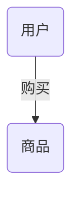
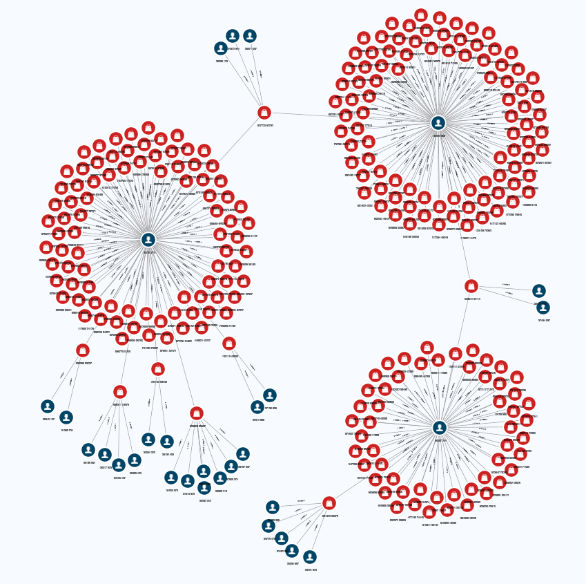
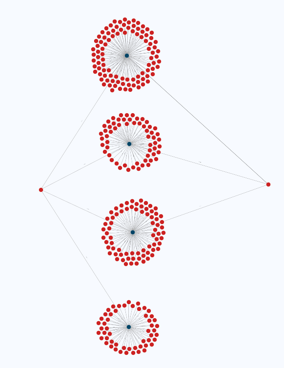
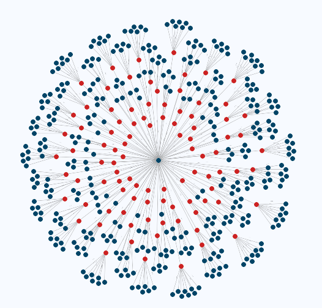

# 用户-商品图

图数据库在电商领域的应用demo

目标用户：电商平台

## Schema



- 点信息

    | 类型 |   数量    |              属性              |
    | :--: | :-------: | :----------------------------: |
    | sku  | 145558964 | 名称、价格、评价数、品牌、品类 |
    | user | 10000000  |               /                |

    商品为京东真实数据，用户随机生成。

- 边信息

    |   类型   |   数量    | 是否有向 |
    | :------: | :-------: | :------: |
    | purchase | 504858339 |   有向   |
    
    每个用户随机购买1~100件商品。
    
- 索引

    | description               | entityTypeNames | propertyNames |
    | ------------------------- | --------------- | ------------- |
    | "INDEX ON :sku(brand)"    | ["sku"]         | ["brand"]     |
    | "INDEX ON :sku(category)" | ["sku"]         | ["category"]  |

- 图展示，其中蓝色为用户点，红色为商品点

  [http://192.168.2.64:8888/visual/index.html#/?name=ecommerce_sku_recommendation](http://192.168.2.64:8888/visual/index.html#/?name=ecommerce_sku_recommendation)
  
  

## Queries

### 常规搜索

1.  关键词搜索【例：刮胡刀】
    - 按价格从低到高
        ```cypher
        MATCH (s:sku)  where s.title CONTAINS "刮胡刀" and s.price > 0 RETURN s ORDER BY s.price ASC LIMIT 5
        ```

        | s                                                            |
        | ------------------------------------------------------------ |
        | {"elementId":"41117211","type":"sku","properties":{"comment_num":"350","price":"0.41","id":"19923841813","title":"久洁（Jojell） 酒店用品一次性剃须刀现货浴场旅店须刨 宾馆客房刮胡刀（200套起订） 13剃须刀+opp包装","category":"家庭清洁/纸品>清洁用具>一次性清洁用品","brand":"久洁/JOJELL"},"primaryKey":"19923841813"} |
        | {"elementId":"42165787","type":"sku","properties":{"comment_num":"350","price":"0.55","id":"19923841817","title":"久洁（Jojell） 酒店用品一次性剃须刀现货浴场旅店须刨 宾馆客房刮胡刀（200套起订） 24剃须刀+opp包装","category":"家庭清洁/纸品>清洁用具>一次性清洁用品","brand":"久洁/JOJELL"},"primaryKey":"19923841817"} |
        | {"elementId":"62088731","type":"sku","properties":{"comment_num":"350","price":"0.64","id":"19923841811","title":"久洁（Jojell） 酒店用品一次性剃须刀现货浴场旅店须刨 宾馆客房刮胡刀（200套起订） 07剃须刀+opp包装","category":"家庭清洁/纸品>清洁用具>一次性清洁用品","brand":"久洁/JOJELL"},"primaryKey":"19923841811"} |
        | {"elementId":"55797274","type":"sku","properties":{"comment_num":"350","price":"0.83","id":"19923841812","title":"久洁（Jojell） 酒店用品一次性剃须刀现货浴场旅店须刨 宾馆客房刮胡刀（200套起订） 07剃须刀+剃须膏+opp包装","category":"家庭清洁/纸品>清洁用具>一次性清洁用品","brand":"久洁/JOJELL"},"primaryKey":"19923841812"} |
        | {"elementId":"47409184","type":"sku","properties":{"comment_num":"135","price":"1.0","id":"29698286686","title":"祝源 民宿酒店便携旅行一次性剃须刀酒店用品浴场旅店客房手动刮胡刀","category":"家庭清洁/纸品>清洁用具>一次性清洁用品","brand":"祝源/ZHUYUAN"},"primaryKey":"29698286686"} |
    
    - 按评价数从高到低
        ```cypher
        MATCH (s:sku)  where s.title CONTAINS "刮胡刀" RETURN s ORDER BY s.comment_num DESC LIMIT 5 
        ```
        | s                                                            |
        | ------------------------------------------------------------ |
        | {"elementId":"49253682","type":"sku","properties":{"id":"13346971030","title":"飞科电动剃须刀迷你型刮胡刀全身水洗胡须刀男士电须刨便携刮胡子刀剃胡刀剃修刀胡子造型器须眉刮胡子两头 砖红色FS871+2刀头","category":"家用电器>个护健康>剃须刀","brand":"飞科/FLYCO"},"primaryKey":"13346971030"} |
        | {"elementId":"49254905","type":"sku","properties":{"id":"13430002162","title":"飞科原装电动刮胡刀充电器FS292 FS295 FS323 FS325电源线配件","category":"礼品>礼品>美妆礼品","brand":"栢盛达"},"primaryKey":"13430002162"} |
        | {"elementId":"49252634","type":"sku","properties":{"id":"13256351364","title":"飞科男电动剃须刀头刮胡刀片配件FR8通用FS373 339 372 360 2刀2网","category":"礼品>礼品>美妆礼品","brand":"栢盛达"},"primaryKey":"13256351364"} |
        | {"elementId":"49251491","type":"sku","properties":{"id":"13171848717","title":"原装博朗电动刮胡刀剃须刀充电器 电源线5030 5030S 5040S充电器","category":"礼品>礼品>美妆礼品","brand":"栢盛达"},"primaryKey":"13171848717"} |
        | {"elementId":"49199872","type":"sku","properties":{"id":"11881411868","title":"OTW手动剃须刀SLK-089刮胡刀刮脸刀不锈钢材质配一盒刀片 1刀架+20刀片","category":"美妆护肤>男士面部护肤>剃须","brand":"OTW"},"primaryKey":"11881411868"} |

    耗时：4min

    模糊查找不支持索引，不推荐直接在图上搜索，需搭配搜索引擎使用。
    
2.   品牌搜索，按评价数从高到低【例："小米/MI"】：
     
    ```cypher
    MATCH (s:sku)  where s.brand = '小米/MI' and s.comment_num > 0 RETURN s ORDER BY s.comment_num DESC LIMIT 5 
    ```
    
    | s                                                            |
    | ------------------------------------------------------------ |
    | {"elementId":"45716278","type":"sku","properties":{"comment_num":"2255298","price":"189.0","id":"7671973","title":"小米路由器4 双千兆路由器 无线家用穿墙 1200M双频无线速率 5G 千兆端口 光纤适用","category":"电脑、办公>网络产品>路由器>家用路由器","brand":"小米/MI"},"primaryKey":"7671973"} |
    | {"elementId":"44645578","type":"sku","properties":{"comment_num":"2255107","price":"199.0","id":"100008355192","title":"小米路由器AC2100 双频路由器 2100M无线家用 5G双频 电竞路由 双千兆 光纤宽带WIFI穿墙 内配千兆网线","category":"电脑、办公>网络产品>路由器>家用路由器","brand":"小米/MI"},"primaryKey":"100008355192"} |
    | {"elementId":"47790521","type":"sku","properties":{"comment_num":"2255098","price":"87.0","id":"100003983432","title":"小米路由器4A 无线双频 四天线稳定穿墙 防蹭网 5G 双频合一 稳定高速 家用路由器 智能APP远程控制","category":"电脑、办公>网络产品>路由器>家用路由器","brand":"小米/MI"},"primaryKey":"100003983432"} |
    | {"elementId":"45694554","type":"sku","properties":{"comment_num":"2255096","price":"169.0","id":"100010581822","title":"Redmi 路由器 AC2100 5G双频 千兆端口 信号增强 WIFI穿墙 游戏路由","category":"电脑、办公>网络产品>路由器>家用路由器","brand":"小米/MI"},"primaryKey":"100010581822"} |
    | {"elementId":"60373070","type":"sku","properties":{"comment_num":"2255095","price":"57.0","id":"100000253890","title":"小米路由器4C(白色) 300M无线速率 智能家用路由器 四天线 安全稳定 WiFi无线穿墙","category":"电脑、办公>网络产品>路由器>家用路由器","brand":"小米/MI"},"primaryKey":"100000253890"} |
    
    耗时：70s 
    
3.   品类搜索，按价格从高到低【例："数码>影音娱乐>耳机/耳麦"】：

    ```cypher
     MATCH (s:sku)  where s.category = '数码>影音娱乐>耳机/耳麦' and s.price > 0 RETURN s ORDER BY s.price DESC LIMIT 
    ```
    | s                                                            |
    | ------------------------------------------------------------ |
    | {"elementId":"55964928","type":"sku","properties":{"comment_num":"1","price":"428000.0","id":"7296653","title":"森海塞尔（Sennheiser）HE1 旗舰高保真HiFi静电耳机","category":"数码>影音娱乐>耳机/耳麦","brand":"森海塞尔/SENNHEISER"},"primaryKey":"7296653"} |
    | {"elementId":"43378345","type":"sku","properties":{"comment_num":"27","price":"32999.0","id":"54526368014","title":"索尼（SONY） IER-Z1R Hi-Res高解析度旗舰入耳式立体声耳机 Z1R耳机+M12SB1金宝线+WM1Z金砖播放器","category":"数码>影音娱乐>耳机/耳麦","brand":"索尼/SONY"},"primaryKey":"54526368014"} |
    | {"elementId":"159937794","type":"sku","properties":{"comment_num":"0","price":"32999.0","id":"69391064300","title":"索尼（SONY） IER-Z1R Hi-Res高解析度旗舰入耳式立体声耳机 Z1R耳机+M12SB1金宝线+WM1Z金砖播放器","category":"数码>影音娱乐>耳机/耳麦","brand":"索尼/SONY"},"primaryKey":"69391064300"} |
    | {"elementId":"138966277","type":"sku","properties":{"comment_num":"0","price":"31999.0","id":"69391064299","title":"索尼（SONY） IER-Z1R Hi-Res高解析度旗舰入耳式立体声耳机 IER-Z1R耳机+NW-WM1Z金砖MP3播放器","category":"数码>影音娱乐>耳机/耳麦","brand":"索尼/SONY"},"primaryKey":"69391064299"} |
| {"elementId":"152252188","type":"sku","properties":{"comment_num":"0","price":"30999.0","id":"68646617436","title":"索尼（SONY） IER-Z1R Hi-Res高解析度入耳式立体声耳机 银色 Z1R+WM1Z金砖","category":"数码>影音娱乐>耳机/耳麦","brand":"索尼/SONY"},"primaryKey":"68646617436"} |
    
     耗时：2min

### 其他查询

1. 查询某品牌旗下主要的产品品类【例："华为/HUAWEI"】：

   ```cypher
   match (s:sku)  WHERE s.brand="华为/HUAWEI" and not s.category CONTAINS "二手"
   with  DISTINCT(s.category) as cate,COUNT(s) as cnt 
   ORDER by cnt DESC
   limit 3
   RETURN cate
   ```
   | cate                      |
   | ------------------------- |
   | "手机通讯>手机>手机"      |
   | "数码>影音娱乐>耳机/耳麦" |
   | "数码>智能设备>智能手环"  |

   耗时：2min

2. 查询某品类下的知名品牌【例："家用电器>大 家 电>空调"】：

   ```cypher
   match (s:sku)  WHERE s.category="家用电器>大 家 电>空调"
   with  DISTINCT(s.brand) as brand,COUNT(s) as cnt 
   ORDER by cnt DESC
   limit 3
   RETURN brand
   ```
   | brand        |
   | ------------ |
   | "美的/MIDEA" |
   | "奥克斯/AUX" |
   | "海尔/HAIER" |

   耗时：40s

3. 好物推荐：推荐购买了这件商品的人也购买的商品【例：id="68557618811"】：

      
      ```cypher
      match (s1:sku)-[p1]-(u:user)-[p2]-(s2:sku)  WHERE s1.id="68557618811"
      with DISTINCT(s2) as rcmd_sku, COUNT(p2) as cnt 
      ORDER by cnt DESC
      limit 3
      RETURN rcmd_sku
      ```
    |rcmd_sku|
    | ------------------------------------------------------------ |
    | {"elementId":"159695340","type":"sku","properties":{"comment_num":"0","price":"323.0","id":"68901986848","title":"06-19款八代凯美瑞门碗拉手防刮贴装饰拉手门碗不锈钢拉手保护套 06-11款黑钛金门碗＋拉手","category":"汽车用品>汽车装饰>车门拉手装饰","brand":"点缤/DIANBING"},"primaryKey":"68901986848"} |
    | {"elementId":"179576939","type":"sku","properties":{"id":"70651239133","title":"帆布袋购物袋尼龙单肩便携可折叠女布袋简约小清新装书袋子环保袋 吊环款 (灰粉)-特惠 纵向中号","brand":"坎乐"},"primaryKey":"70651239133"} |
    | {"elementId":"111387378","type":"sku","properties":{"id":"64272264054","title":"家用安全普通老式防盗门锁子卧室室内木门外装门锁双舌556通用型 红钻556铜胆锁一套 35-50mm 通用型 带钥匙","category":"家装建材>五金工具>机械锁","brand":"李绅"},"primaryKey":"64272264054"} |

    耗时：1s

4. 好友推荐：推荐购买记录与该用户重合度最高的用户【例：id="00000032"】：

    

    ```cypher
    match (u1:user)-[p1]-(s:sku)-[p2]-(u2:user)  WHERE u1.id="00000032"
    with DISTINCT(u2) as rcmd_user, COUNT(p2) as cnt 
    ORDER by cnt DESC
    limit 3
    RETURN rcmd_user
    ```
    | rcmd_user                                                    |
    | ------------------------------------------------------------ |
    | {"elementId":"2349657","type":"user","properties":{"id":"08080162"},"primaryKey":"08080162"} |
    | {"elementId":"30692620","type":"user","properties":{"id":"09085341"},"primaryKey":"09085341"} |
    | {"elementId":"2163929","type":"user","properties":{"id":"02136866"},"primaryKey":"02136866"} |

    耗时：1s

5. 精准推荐：

    上述推荐都是粗略的推荐，要实现精准推荐需要图数据库底层实现推荐算法，例如PersonalRank。
    
    